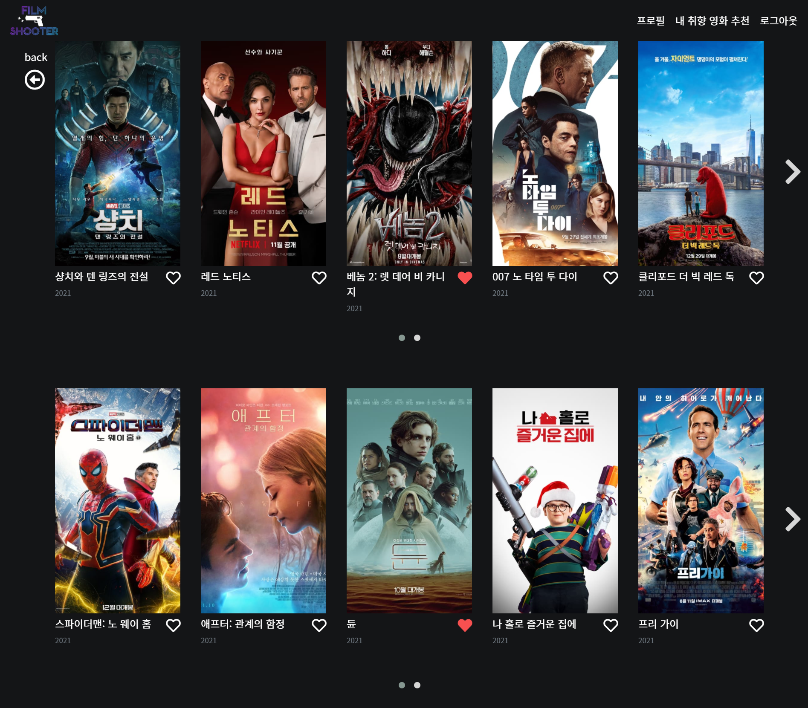
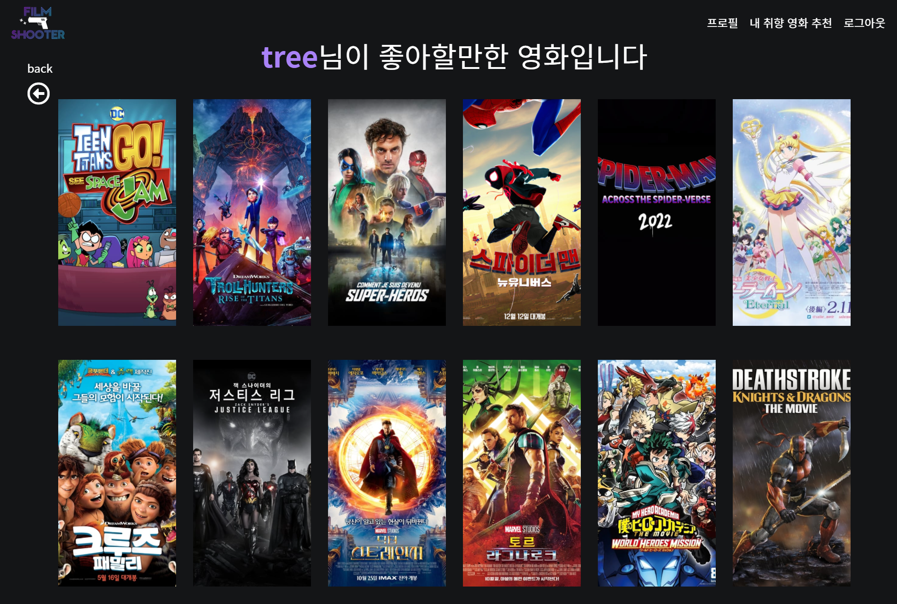
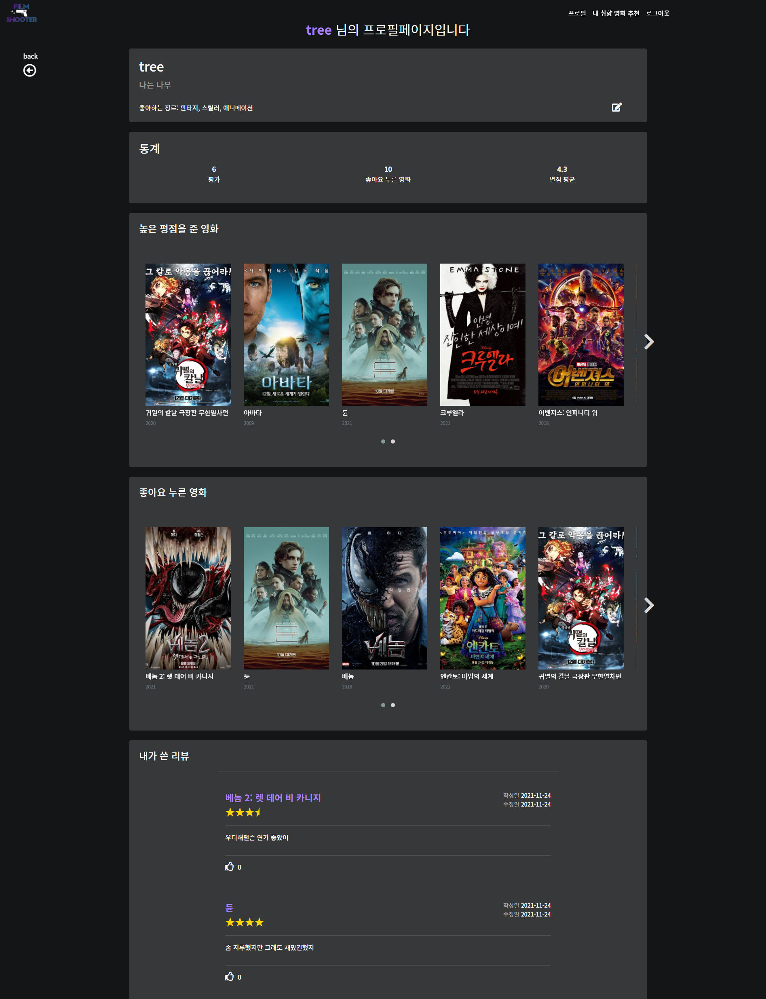
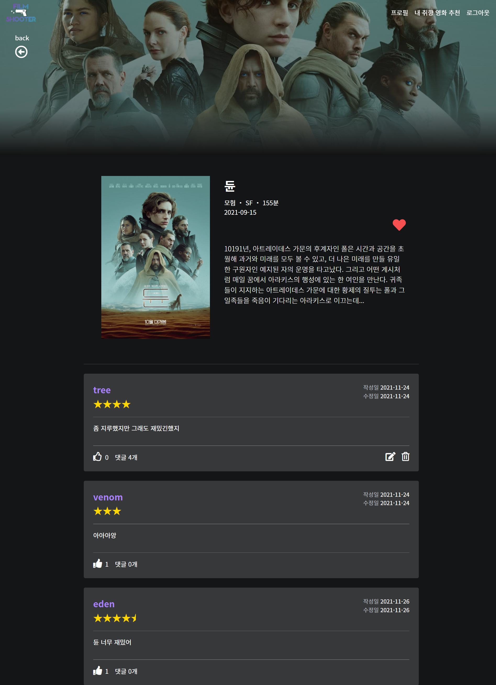
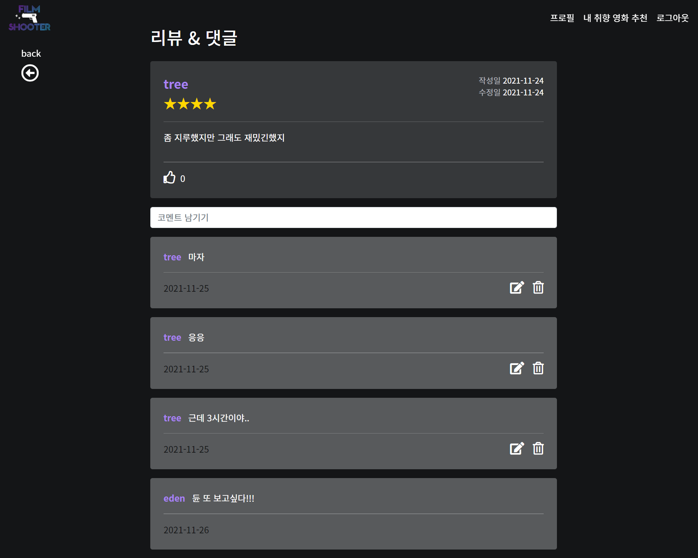
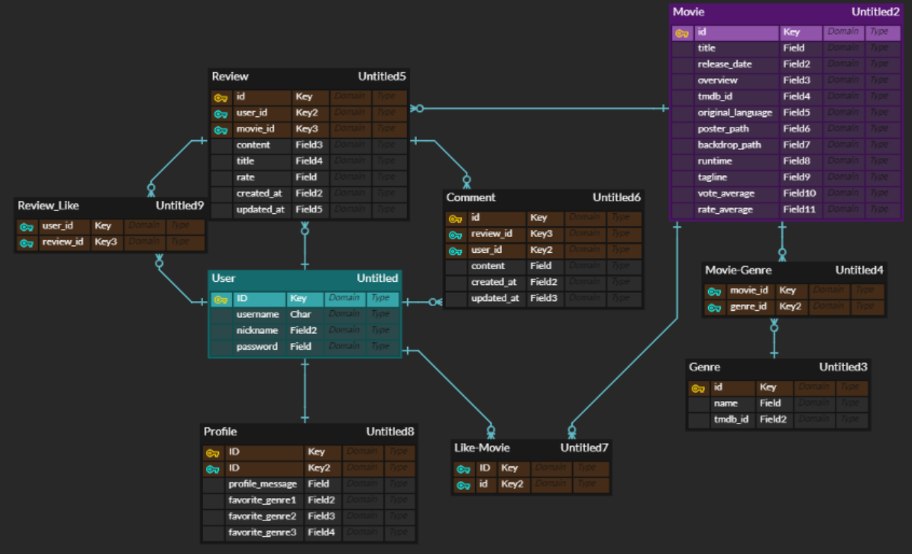
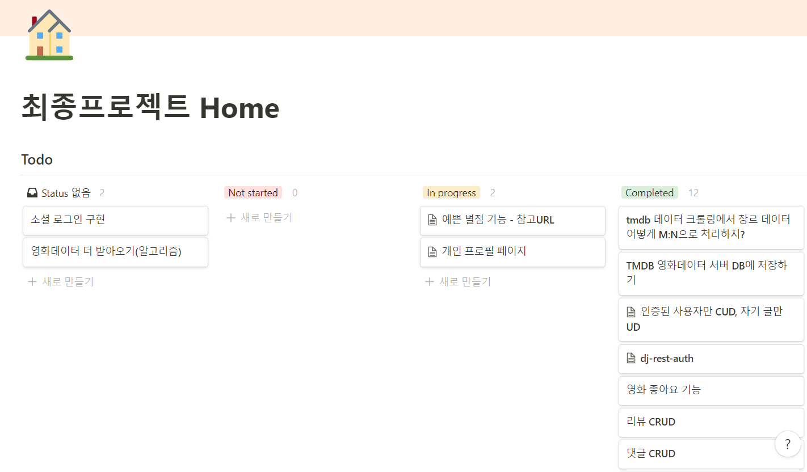
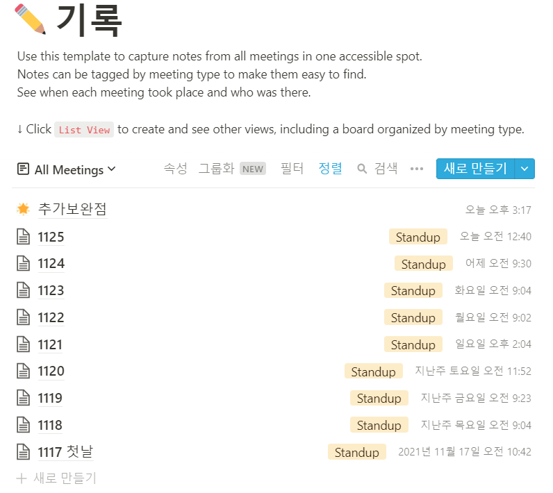
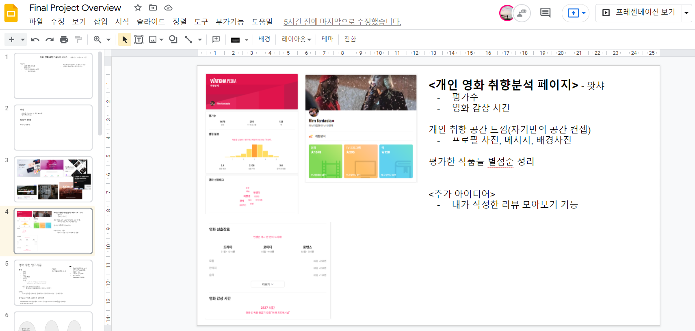

# Final PJT

> maintainer: 채예은, 이성재

## 1. 팀원 정보 및 업무 분담 내역

### 팀장 채예은

- DRF
- 프로필 페이지 구성

### 팀원 이성재

- Vue
- 추천 알고리즘


함께 개발했습니다. :smile:

## 2. 목표 서비스 구현 및 실제 구현 정도

- 서비스 이름 : Film Shooter ​

  - 당신의 영화 취향을 저격한다! 탕탕! :gun:

  - 로고

    

-  목표 서비스
  - 사용자 영화 취향 정보를 기반으로 하는 영화 추천 & 커뮤니티 서비스
  - 알고리즘
    - 사용자의 리뷰 평점과 좋아요 한 영화 정보를 분석해서 전반적인 영화 취향 예상
  - 커뮤니티
    - 프로필 페이지를 통해 자신의 취향 확인 및 다른 사용자와 소통
    - 감상한 영화에 대한 리뷰와 코멘트를 남기는 서비스
- 실제 구현
  - 알고리즘
    - 사용자의 리뷰, 좋아요 데이터를 바탕으로 장르 취향만 분석
  - 커뮤니티
    - 프로필 페이지 구현, 사용자의 통계 정보 제공
    - 좋아요 누른 영화, 높은 평점을 매긴 영화 모아보기
    - 내 리뷰 모아보기


### 메인페이지




### 영화 추천 페이지




### 프로필 페이지




### 영화 상세페이지




### 리뷰 & 댓글 페이지




## 3. 데이터베이스 모델링




- Accounts
  - User
  - Profile
- Movies
  - Movie
  - Genre
- Reviews
  - Review
  - Comment


## 4. 필수 기능에 대한 설명

### A. 관리자 뷰

- Django admin 기능을 이용해 구현했습니다.
- 관리자 권한의 유저는 영화 등록 / 수정 / 삭제, 리뷰 코멘트 관리, 유저 관리를 할 수 있습니다.

### B. 영화 정보

- TMDB API를 이용했습니다.
- TMDB popular movie들을 데이터로 가져왔습니다.
- 영화 데이터 : 500개

### C. 추천 알고리즘

- 사용자가 작성한 리뷰의 평점과 좋아요를 바탕으로 24개의 영화를 추천했습니다.
- 사용자의 평점과 좋아요를 바탕으로 다음과 같이 사용자의 장르 취향 벡터를 구합니다.
- 평점
  - 평점을 매긴 영화의 장르에게 평점만큼 점수를 줍니다.
- 좋아요
  - 좋아요를 누른 영화의 장르에게 4점의 점수를 줍니다.
- 모든 영화들에 대해, 각 영화의 장르 벡터와 사용자 취향 벡터의 코사인 유사도를 구합니다.
- 사용자가 이미 리뷰를 남긴 영화를 제외하고 상위 24개의 영화를 골라 추천합니다.

### D. 커뮤니티

- 영화 리뷰와 리뷰에 대한 코멘트를 작성할 수 있습니다. 
- 로그인하지 않은 사용자는 조회만 가능합니다.
- 리뷰
  - 로그인한 사용자만 리뷰를 작성 / 수정 / 삭제 할 수 있습니다.
  - 작성자만 수정 / 삭제할 수 있습니다.
  - 한 영화 당 하나의 리뷰만 작성할 수 있습니다.
  - 작성 폼은 모달로 구현했습니다.
- 코멘트
  - 로그인한 사용자만 코멘트를 작성 / 수정 / 삭제 할 수 있습니다.
  - 작성자만 수정 / 삭제할 수 있습니다.
  - ※ 댓글은 디자인을 고려해서 작성일만 표시했습니다.
  - 댓글 리스트 상단에 input tag에 댓글을 작성할 수 있습니다.

## 5. 보완할 점

### 서비스 개선

- 영화 검색 기능
- 인피니트 스크롤
- 소셜로그인

### 프로필페이지

- 프로필 사진, 프로필 배경 사진
- profile 모델 user모델에 합쳐버리기
- profile 좋아하는 장르 - 직접 입력 대신 알고리즘에서 분석한 결과를 보여주기

### 알고리즘

- 국내 / 해외 영화 선호도를 판별해 취향분석에 반영
- 왓챠처럼 여러 영화들 무한 스크롤 내리면서 별점 매기는 기능

### DB

- 인기 순위를 주기적으로 업데이트
  - ex) 하루에 2번 인기 순위 리스트를 업데이트해야함 → 스케줄러 필요?
  - DB를 아예 업데이트?
  - 아님 테이블을 2개로 나누어서 하나는 알고리즘용 데이터 쌓아놓는 테이블, 하나는 현재 인기순위 테이블
- DB에 배우, 감독 데이터도 넣기

## 6. 기타

### 협업

- 노션 활용
  - [노션 링크](https://periwinkle-brain-4b6.notion.site/Home-74664ca681cb4ef89b410a2fac334ddd)






- 구글 프레젠테이션




## 7. 개발 일정 & 트러블 슈팅 기록

### 11.17

#### What did we do yesterday?

- ERD로 모델링
- 전반적인 기획 - 구글 프레젠테이션 활용

#### What will we do today?

- [x]  노션 공유하기
- [x]  컨셉 이야기하기 ⇒ 일단 기본부터 만들지 & 취향을 기반으로 한 개인 프로필
- [x]  데이터 수집(API) - movie 데이터 json으로 저장
- [x]  리포 프론트, 백 각각 생성
- [ ]  장고- 모델 생성
- [ ]  장고- serializer 생성
- [x]  ovenapp으로 페이지 기획

#### 기록

- API requests에서 계속 오류가 났다.
  - `f-string` 을 사용하면서 f를 붙이지 않아서였다.
  - 자바스크립트에게만 너무 애정을 쏟았다. 파이썬에게도 관심을 주자.
- 페이지 구성을 어떻게 할지 ovenapp으로 만들어봤다. 하지만 아직 미완이다. 대략적으로만 짜봤다.
  - Home: 랭킹별 영화 보여주기
  - Recommend: 개인 취향에 맞는 영화를 추천
  - Detail: 예고편 포함, 리뷰는 밑으로 스크롤 내리면서 보는 방식으로.
- TMDB API에서 데이터를 가져와 저장했다. 데이터를 모델에 저장할 모습으로 수정해야한다.
  - 한글 깨짐 문제 → .dump() 안에 `ensure_ascii=False` 을 넣어서 해결

### 11.18

#### 아침회의

##### What will we do today?

- [x]  Movie 데이터 DB에 저장 - serializer
- [x]  서버 - movies, reviews 모델 만들기
- [x]  Vue 시작하기
- [ ]  serialization 이유 라이브강의 다시 보면서 찾기

#### 하루 기록

#### 트러블슈팅

##### Serialization

- 상황

  - API에서 받아온 영화데이터를 DB에 저장하려고함.

- 문제

  - Movie 모델의 genres 필드는 ManyToManyField → 어떻게 저장하지???
  - ManyToManyField 저장이 어려움
  - 데이터는 genre_ids 라는 이름의 필드로 입력됨 → genres로 저장하고 싶음

- 해결

  ```python
  class MoviesSerializer(serializers.ModelSerializer):
      class GenresSerializer(serializers.ModelSerializer):
          class Meta:
              model = Genres
              fields = ('id', 'name')
  
      genres = GenresSerializer(many=True, read_only=True)
      genre_ids = serializers.ListField(write_only=True)
      id = serializers.IntegerField(source='tmdb_id')
  
      class Meta:
          model = Movies
          fields = ('title', 'genres', 'genre_ids', 'id', 'popularity', 'release_date', 'overview', 'original_language', 'poster_path', 'rate_average')
  
      def create(self, validated_data):
          genre_ids = validated_data.pop('genre_ids')
          movie = Movies.objects.create(**validated_data)
          for genre_id in genre_ids:
              genre = Genres.objects.get(tmdb_id=genre_id)
              movie.genres.add(genre.pk)
          return movie
  ```

  - Nested Serializer 이용. source 인자에 Model 필드명.
  - create 메서드를 override. Genre 테이블에서 직접 pk를 찾아서 중개 테이블에 추가함.

#### DumpData

> **loaddata** `python manage.py loaddata <filename>`

> **dumpdata** `python manage.py dumpdata --indent 4 <app_name>[.ModelName]`

- 상황

  - DB에 데이터를 Fixtures로 dump하는데 인코딩 문제로 에러 발생
  - 영화데이터 중 외국어 문자 때문에 문제가 발생하는 것 같음

- 문제

  - `python manage.py dumpdata -—indent 4 movies > movies.json`
  - 했더니 에러 발생

  해결

  - dumpdata cp949 error 로 검색해서 [블로그 글](https://velog.io/@swhan9404/프로젝트-트러블슈팅-DumpData) 참고
  - `-Xutf8` 을 추가함
  - 코드: `python -Xutf8 manage.py dumpdata --indent 4 movies > movies.json`

##### Vue - mapstate

- 상황
  - Home.vue에서 store의 state에 있는 데이터를 가져오고 싶었음
  - `import { mapState } from 'vuex'`  mapState를 임포트하고 data에 넣었음
- 문제
  - data에 데이터가 제대로 안들어옴
- 해결
  - 🌟 mapState는 data가 아니라 computed에 써야한다.

#### 내일 할일

- 영화 디테일 페이지 구현
- 영화 리뷰 작성 페이지 만들기
- 댓글 CRUD
- 서버 리뷰, 댓글 serializer 만들기
- 서버 리뷰, 댓글 api 만들기
- 핵심기능인 리뷰 먼저 만들고, 그 후에 유저(인증, 권한) 기능 만들자!

### 11.19

#### 아침회의

#### What will we do today?

- [x] 캐러젤 시도 → 성공!!
- [ ] 리뷰, 댓글 기능 완성 (백/프론트 각각 나눠서)
- [ ] 프로필 페이지 기획 설계 : 좋아요 누른 영화, 평점 높게 준 영화, 내 리뷰 모아보기, 통계(좋아요, 리뷰쓴 영화), 사용자에게 정보 받기(좋아하는 장르, 좋아하는 영화 top3), 영화 감상 시간

#### 하루 기록

#### 서버 

- Create review 할 때 like_user가 필수 필드로 되어있어서 `blank=True` 로 바꿨다.

- blank=True 말고 serializer에서 하는 방법 찾아보기 ⇒ UserSerializer 를 만드려고 settings를 임포트 하려는데 에러가 남 ㅠㅠ
-  `from ..final_pjt_back import settings`

- 해결
  - ReviewSerializer에서 `read_only_fields = ('user', 'like_users',)`

- ❓ 리뷰/댓글 수정, 삭제 url에 <movie_pk> 필요없는 것 같음. → 수정

#### 클라이언트

- Review 작성 폼을 모달로 만들기로 했다. bootstrap을 사용하기 위해 `main.js`에 `import 'bootstrap'` 으로 임포트 했다.

#### 트러블슈팅

##### 영화 카드 Carousel

- 상황
  - Home 페이지에서 Movie card list를 옆으로 넘기는 형식으로 구현하고 싶었다.
- 해결
  - vue-owl-carousel 라이브러리? 활용 [(블로그 참고)](https://question0.tistory.com/14)
  - `npm i vue-owl-carousel`

##### ReviewUpdateForm 기본값 채우기

- 상황
  - review를 수정하는 ReviewUpdateForm을 만들었다.
  - input창에 기존 리뷰 내용을 채우려고 한다. 기존리뷰는 props로 받아온 상태
  - input 안에 `v-model="myReview"` 로 data의 myReview와 양방향 연결한 상태
- 문제
  - input 안에 `value="..."` 으로 값을 넣으려하니 v-model과 충돌이 일어난다고 오류 남
- 해결
  - v-model로 연결되어있는 data의 myReview에 props로 받아온 기존리뷰 데이터를 넣어서 해결.

##### 단일 리뷰 조회할 때 댓글들도 함께 보내주기

- 상황

  - 댓글은 특정 리뷰에 달려있다. 그래서 댓글 조회를 따로 만들지 않고 review detail 조회할 때 해당 리뷰에 달린 댓글들도 한번에 보내기로 함

  - ReviewSerializer 안에 comments를 serializing해서 같이 보내려고 시도함

    ```python
    class ReviewSerializer(serializers.ModelSerializer):
    
        # READ only
        comments = CommentSerializer(many=True, read_only=True)
    
        class Meta:
            model = Review
            # fields = '__all__'
            fields = ('comments', 'id', 'user', 'movie', 'rate', 'content', 'created_at', 'updated_at', )
    ```

- 문제

  - 리뷰 조회시 ReviewSerializer에서 댓글들이 출력되지 않음

- 해결

  - related_name을 설정하지 않아서 필드 이름을 comments가 아니라 comment_set로 해야했다. (comments라고 쓰려면 모델에서 ForeignKey 안에 'related_name'='comments'로 해야함.)

##### 별점 예쁘게 보여주기

- 상황
  - 리뷰 별점을 왓챠피디아처럼 동적으로 보여주고 싶었다.
  - [참고 URL](https://codepen.io/chris22smith/pen/MJzLJN) 을 참고했다. radio input을 만들고 label에 img를 넣었다.
- 문제
  - JavaScript를 이용해 클릭하면 이미지의 src를 바꾸도록 했는데 동작하지 않았다.
- 해결
  - 이미지 src 주소를 `required()`안에 넣었더니 동작했다.
  - JavaScript 내에서 정적 자산을 사용하기 위해선 nodeJS의 `require`를 사용해야 Webpack이 제대로된 경로를 읽을 수 있다고 한다.
  - [Vuejs template github.io](https://vuejs-templates.github.io/webpack/static.html#getting-asset-paths-in-javascript) 의 **Handling Static Assets** 내용

# 내일 할일

### 구현해야할 기능

- 개인 프로필 페이지
- 댓글
- 추천 기능(알고리즘)
- 리뷰 좋아요 기능
- 프로필 페이지 기획 설계 : 좋아요 누른 영화, 평점 높게 준 영화, 내 리뷰 모아보기, 통계(좋아요, 리뷰쓴 영화), 사용자에게 정보 받기(좋아하는 장르, 좋아하는 영화 top3), 영화 감상 시간
- dj-rest-auth 알아보기

### 11.20

### 11.21

#### 예쁜 별점 기능

[참고 URL](https://codepen.io/chris22smith/pen/MJzLJN)

- 별 이미지를 클릭해서 평점을 매길 수 있게 했음.
- 별 이미지 png 파일 assets에 저장했음.
- 별 반개짜리를 만들었는데, model에 rate가 IntegerField 였음...😢
- 아직 구현 못한 것 😢
  - 마우스 hover했을 때 노란색으로
  - 리뷰 업데이트시 기존 평점대로 표시

### 11.22

#### 리뷰 좋아요 기능

##### 서버

- like view 함수
- like url
- 단일 리뷰 조회 serializer에 like_users_count 필드
- +추가 사항 : 전체 리뷰 조회 시에 좋아요 순으로 정렬해서 보내면 좋을 듯

##### 클라이언트

- 좋아요 버튼, 좋아요 눌렀는지 여부에 따라 다른 렌더링
- 좋아요 누른 수

#### 프로필 페이지

##### 서버

- 프로필 페이지 URL
- 유저 정보 serializer
  - 기본 정보 : username, nickname, 유저가 쓴 review & movie,
  - 추가 정보 :  profile image,

##### 클라이언트

- 프로필 페이지 라우터
- 프로필 페이지 이동 버튼( Home, Review)
- 컴포넌트 구성

### 11.23

#### 인증된 사용자만 CUD

- 인증된 사용자만 CUD할 수 있도록 하는 기능은 아래의 코드로

```python
# settings.py

REST_FRAMEWORK = {
    'DEFAULT_PERMISSION_CLASSES': (
        'rest_framework.permissions.IsAuthenticated',
    ),
}
```

- 자신의 글만 UD 할 수 있는건
  - 서버 : view함수에서 request.user 확인한 후 수행
  - 클라이언트 : username이 일치하는 글만 수정 삭제 버튼을 보여준다.

### 11.24

#### 아침회의

#### What will we do today?

- 백 머지

- 프론트 머지
- Movie 모델, fixture update

#### TMDB 영화데이터 field 활용 회의

- popurlarity → 버림

- 국가를 알아보는 필드 → 적당한게 없음

  - ```
    production_countries
    ```

     를 활용하려 했지만 투자를 많이 한 국가로 나오는 것 같아 부적합

    - ex) 베놈의 `production_countries` : 중국

- original language로 국내, 해외만 구분?

#### 추가로 가져올 필드

- tagline: 캐치프레이즈 같음
- vote_average

#### 하루 기록

##### 트러블슈팅

- 로그인 모달창 안꺼짐

##### 디자인

- review 모델 content없이 평점만 등록하는것도 가능하도록 수정
- Home 화면 하트 수정
- NavBar 우측 하단 버튼으로 구현
  - 로그인 회원가입 버튼 변경
- 폰트 색 수정 📌
- 백드롭 이미지 없으면 없애기
- carousel next, prev버튼 수정
- 리뷰 삭제하고 다시 작성할 때 문제 해결
- 삭제 수정 아이콘으로 모두 변경 📌
- 삭제 시 확인하는 모달 만들기
- 추천 페이지 포스터에 태그라인 달기 📌
- 배경색 100% 차게 → index.html에서 body에 클래스로 배경을 줌
- 프로필페이지, 리뷰 username ⇒ nickname으로 수정
- 프로필 페이지 디자인 수정 📌
- 프로필 내가 쓴 리뷰리스트 볼 때 작성자 없게 바꾸기(if를 활용하면 될 것 같음)
- 완성하기 🍰

#### 트러블슈팅

##### Git

- 둘이서 각자 짠 코드 합치는 과정
- 


##### 로그인/사인업 모달창 안꺼짐

- 해결

  - [스택오버플로우](https://stackoverflow.com/questions/23677765/bootstrap-modal-hide-is-not-working)

  ```jsx
  const myModal = document.querySelector('#signupModal')
  myModal.classList.remove("in")
  document.querySelector(".modal-backdrop").remove()
  myModal.style.display = "none"
  ```

### 11.25

#### 아침회의

📌 오늘 6PM 마감

#### What will we do today?

- 우리 서비스 이름 정하기 & 미리캔버스로 로고 만들기
  - 영화 + LSJ / CYE
  - movie you want → MYW
  - infinite movie
  - film shooter / film sniper / movie sniper /
  - ⇒ **film shooter**
- ppt 만들기(내일 아침 9시)
- review아이템에서 평점을 별로 표현하기
- 뒤로가기 버튼 구현
- navbar에 안녕하세요 nickname님!
- Home버튼 → 집모양 아이콘으로
- 영화 검색 기능 구현

#### 프로필페이지

- 프로필 페이지 수정 폼 만들기
